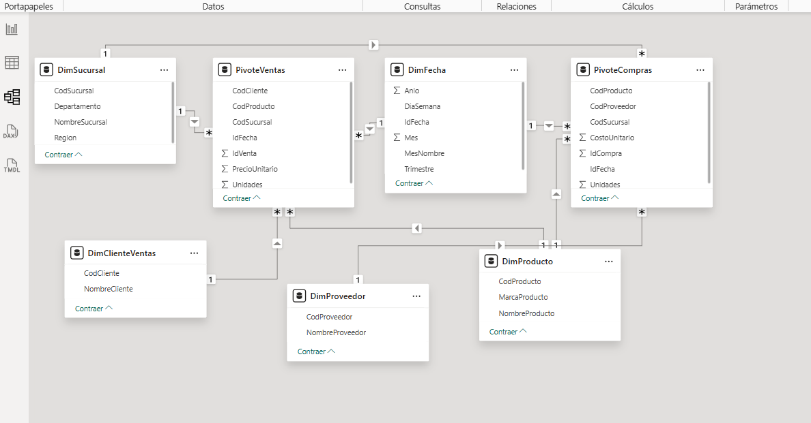
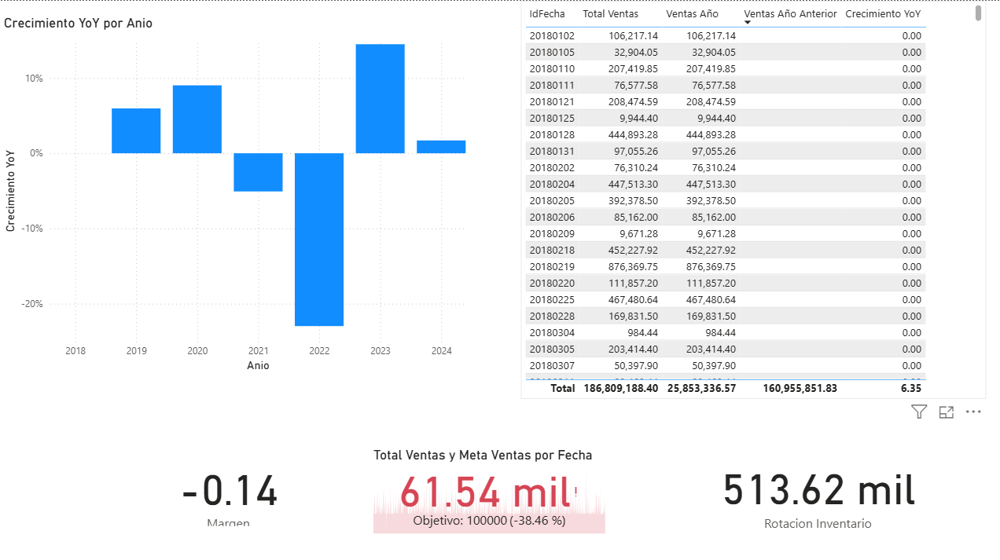

# -SS2_S22025_201906173
SEMI2


# Documentación de KPIs en Power BI

Este documento describe los principales **KPIs** construidos en Power BI a partir del modelo de datos de ventas y compras.  
Cada indicador está acompañado de su lógica en DAX y una breve interpretación de su utilidad.

---

## 1. KPI: Margen

**Definición:**  
El margen mide la rentabilidad de las ventas restando los costos del total de ingresos y normalizando el resultado.

**Medida en DAX:**
```DAX
Margen = DIVIDE([Total Ventas] - [Total Costos], [Total Ventas], 0)
```

**Interpretación:**  
En la tarjeta visual se observa un margen negativo (-0.14), lo que indica que actualmente los costos superan los ingresos. Este KPI permite evaluar la eficiencia operativa y la sostenibilidad del negocio.

---

## 2. KPI: Cumplimiento de Meta de Ventas

**Definición:**  
Mide el porcentaje de ventas realizadas respecto a la meta establecida.

**Medida en DAX:**
```DAX
Cumplimiento Meta = DIVIDE([Total Ventas], [Meta Ventas], 0)
```

**Interpretación:**  
El KPI muestra un cumplimiento de **61.54 mil vs. objetivo de 100 mil**, equivalente a un **-38.46%** de desviación negativa. Esto evidencia que no se alcanzó la meta planteada.

---

## 3. KPI: Crecimiento YoY (Year over Year)

**Definición:**  
Indica la variación porcentual de las ventas de un año frente al año anterior.

**Medida en DAX:**
```DAX
Crecimiento YoY =
VAR AnioActual     = MAX(DimFecha[Anio])
VAR VentasActual   = [Total Ventas]
VAR VentasAnterior =
    CALCULATE(
        [Total Ventas],
        FILTER(
            ALL(DimFecha),
            DimFecha[Anio] = AnioActual - 1
        )
    )
RETURN
DIVIDE(VentasActual - VentasAnterior, VentasAnterior, 0)
```

**Interpretación:**  
En el gráfico de barras se observa un crecimiento positivo en 2019 y 2020, una caída fuerte en 2022 (-20% aprox.) y recuperación en 2023. Este KPI es esencial para analizar tendencias anuales y planificar decisiones estratégicas.

---

## 4. KPI: Rotación de Inventario

**Definición:**  
Evalúa la rapidez con la que se renueva el inventario en función de los costos de ventas y las unidades promedio en stock.

**Medida en DAX:**
```DAX
Rotacion Inventario =
DIVIDE([Total Costos], AVERAGE(PivoteCompras[Unidades]))
```

**Interpretación:**  
El resultado muestra una **rotación de 513.62 mil**, lo cual refleja un nivel alto de movimiento de inventario. Este indicador es clave para gestión de logística y control de inventarios.

---

# Conclusión General

Estos 4 KPIs permiten visualizar un panorama integral de la operación:

- **Margen**: Evalúa la rentabilidad.  
- **Cumplimiento de Meta**: Mide desempeño contra objetivos.  
- **Crecimiento YoY**: Analiza la tendencia anual.  
- **Rotación de Inventario**: Controla eficiencia logística.

Con estos indicadores, la gerencia puede tomar decisiones informadas sobre costos, ventas, metas y gestión de inventarios.

---



